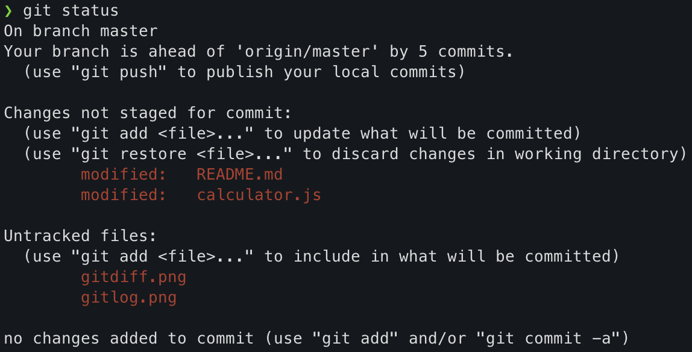
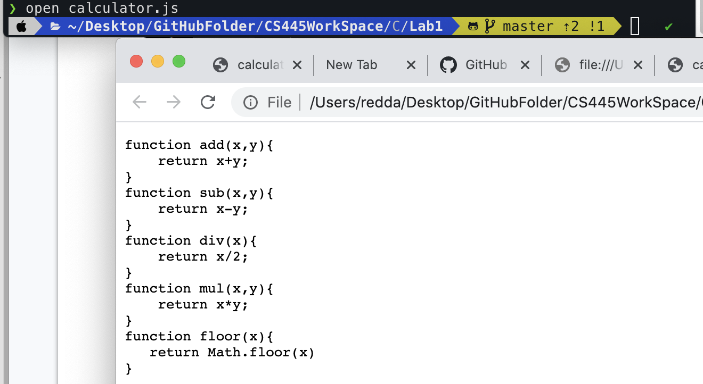
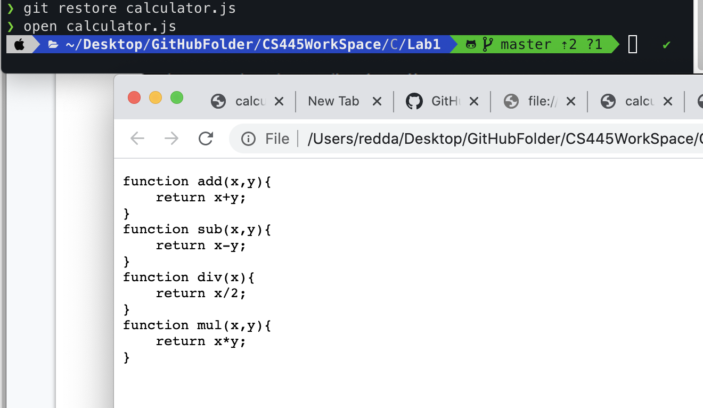

### CS445 Lab1
## git init

## git tag -a "tagname" -m "message related to the tag"

### before added tag name to 0ec7094 SHA

### after added tag name to 0ec7094 SHA

### git diff commands

### git log 
 
 ### git status before add
 
 ### git status after add
 
 ### commit 
 
 ### before commit 
 
 ### after commit 
 
 ### git show command 
 
 ### git show command 
 

 ### git updated comments 
 *  git commit --amend -m  "return multiplication*
 ### git restore filename
 ### before restore
  
### after restore the 

